# Multi-Agent AI Collaboration for Multimodal Medical Diagnosis

**Honours Thesis — University of Technology Sydney (UTS), 2026**

> A systematic investigation of how AI agents should communicate and collaborate for medical diagnosis, comparing four communication mechanisms and five orchestration architectures on the NEJM Image Challenge (689 cases).

[](https://python.org)
[](https://github.com/langchain-ai/langgraph)
[](https://github.com/openai/openai-agents-python)
[](https://wandb.ai)
[](https://smith.langchain.com)

---

## Key Findings

| Finding | Evidence |
|---|---|
| **The bottleneck is arbitration, not perception** | Oracle ceiling of 65.5% (agents collectively know the answer) vs ~51% best extraction |
| **Every fusion mechanism degrades the strong text agent** | Text-only 51.5% > every multi-agent config; fusion net -34 to -60 on changed answers |
| **Debate causes sycophantic convergence** | Strong agent degrades (54.3% to 42.7%), weak agent improves, oracle ceiling *falls* (451 to 430) |
| **Selective fusion is the only winning strategy** | Conditional routing: direct cases reach 55.7% (above text-only baseline) |
| **Deterministic guarding beats LLM arbitration** | Conservative guard: net +3 on changes vs net -34 for unguarded fusion |
| **Latent communication (ThoughtComm) avoids persuasion bias** | Text agent +9.2pp via latent transfer vs -7.1pp via natural-language debate |
| **Vision floor is task-intrinsic, not model-specific** | MedGemma 33.2% = Qwen2.5-VL 30.3% on context-free NEJM images |
| **Confidence has a dual role** | Unreliable for arbitration (41.5%) but informative for triage routing (56% vs 29% split) |

---

## The Problem

Medical diagnosis requires integrating clinical text (patient history, symptoms) with visual evidence (X-rays, MRI, dermatology photos). Multi-agent AI systems decompose this task: a **text specialist** reasons from the clinical vignette, a **vision specialist** interprets the image, and a **fusion mechanism** combines their assessments.

The intuitive expectation -- that two specialists collaborating should outperform either alone -- consistently fails. This project investigates *why*, across 12 experimental configurations, and identifies when collaboration helps vs. harms.

<!-- TODO: Replace with your oracle gap figure -->
<p align="center">
  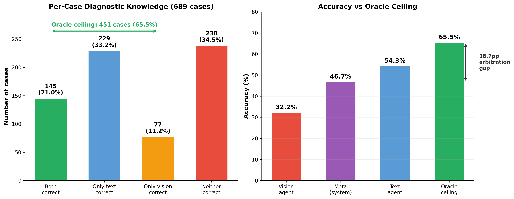
  <br/>
  <em>The arbitration gap: agents collectively hold the answer in 65.5% of cases, but no fusion mechanism extracts more than ~51%.</em>
</p>

---

## Architecture Overview

The project progresses through a connected series of experiments, each building on the failure modes diagnosed by the previous one.

### Communication-Mechanism Experiments (OpenAI Agents SDK)

These hold the architecture fixed and vary how agents communicate:

| Experiment | Communication | Meta Accuracy |
|---|---|---|
| Mode 1: CoT output-only | Free-text answer + reasoning | 40.9% |
| Mode 2: CoT debate | Agents revise after seeing each other's reasoning | 46.0% |
| Mode 3: Structured JSON | Typed schema with confidence scores | 44.9% |
| Mode 3b: Structured + debate | JSON format with revision round | 46.7% |
| ThoughtComm | Latent hidden-state transfer (no natural language) | 44.2%* |

*\*339-case held-out split; text agent improved +9.2pp (opposite of debate's -7.1pp degradation)*

### Orchestration-Architecture Experiments (LangGraph)

These redesign the fusion strategy based on diagnosed failure modes:

| Architecture | Strategy | Accuracy | Key Result |
|---|---|---|---|
| Describe-then-fuse | Vision describes only, never diagnoses | 48.9% | First to beat single-agent baselines |
| Directed debate | Text agent queries vision with specific questions | 45.6% | Persuasion bias persists even when asymmetric |
| Conditional debate | Debate only on disagreement/low confidence | **50.9%** | Direct cases: 55.7% (above text-only baseline) |
| Option ranking | Each modality scores all 5 options | 50.8% | Clearest fusion-harm demo: text 55.7% to fused 50.8% |
| Conservative conditional | Deterministic guard, no LLM orchestrator | 49.4% | Only mechanism with net-positive changes (+3) |

---

## Architecture Diagrams

### Phase 1: Communication-Mechanism Experiments

#### Mode 1: Chain-of-Thought (Output-Only)

<!-- TODO: Replace with your Mode 1 architecture diagram -->
<p align="center">
  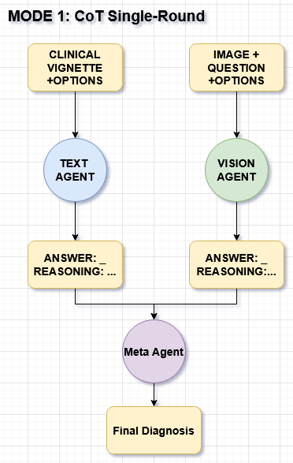
  <br/>
  <em> CoT Single Round — both specialists produce answer + reasoning; fusion agent selects final answer.</em>
</p>

- **Text agent**: vignette + options (no image) --> answer + reasoning
- **Vision agent**: image + question + options (no vignette) --> answer + reasoning
- **Meta agent**: both outputs --> final answer
- All roles: MedGemma-1.5-4B

#### Mode 2: Chain-of-Thought Debate

<!-- TODO: Replace with your Mode 2 architecture diagram -->
<p align="center">
  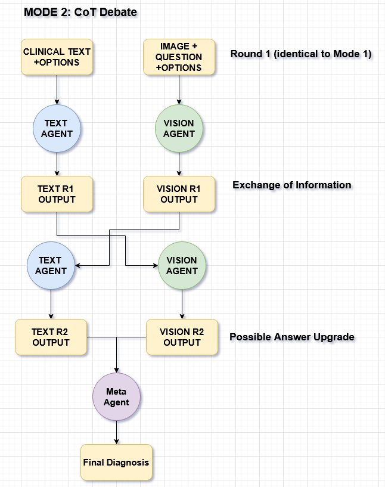
  <br/>
  <em> CoT Debate — agents exchange reasoning and revise before fusion.</em>
</p>

- Round 1 identical to Mode 1
- Exchange: each specialist sees the other's R1 reasoning
- Both revise (symmetric debate)
- Meta agent sees revised R2 outputs
- **Key finding**: text agent degrades 50.4% to 41.7% (net -60), oracle ceiling falls 439 to 381

#### Mode 3/3b: Structured JSON (+ Debate)

<!-- TODO: Replace with your Mode 3 architecture diagram -->
<p align="center">
  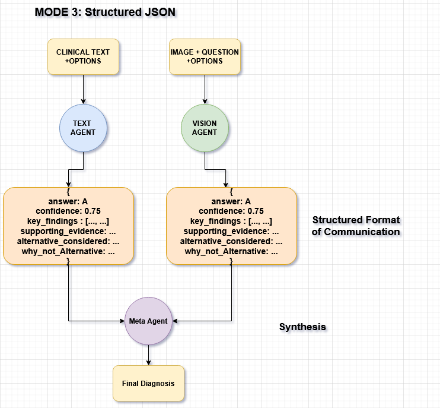
  <br/>
  <em> Structured JSON: typed schema with answer, confidence, key findings, and alternatives.</em>
</p>

<!-- TODO: Replace with your Mode 3b architecture diagram -->
<p align="center">
  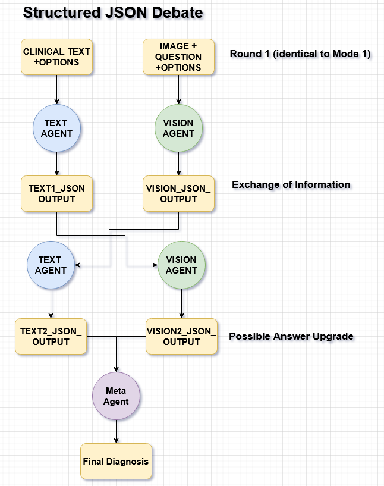
  <br/>
  <em> Structured JSON Debate: combines structured format with a revision round.</em>
</p>

#### ThoughtComm

<!-- TODO: Replace with your ThoughtComm architecture diagram -->
<p align="center">
  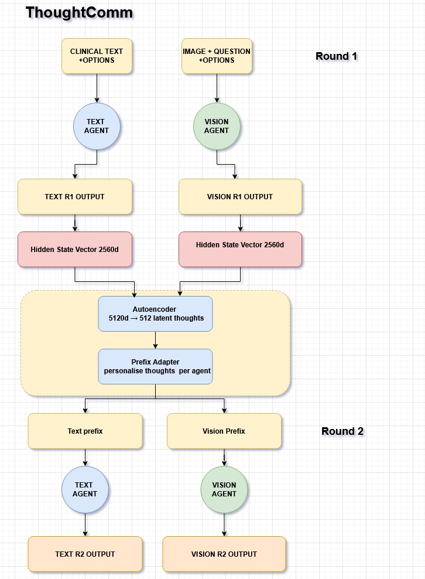
  <br/>
  <em> ThoughtComm: agents communicate via latent hidden-state representations, not natural language. Autoencoder compresses 5120d joint vectors to 512 latent thoughts; prefix adapter injects personalised thoughts into frozen MedGemma.</em>
</p>

---

### Phase 2: LangGraph Orchestration Architectures

#### 1. Describe-then-Fuse

<!-- TODO: Replace with your describe-then-fuse diagram -->
<p align="center">
  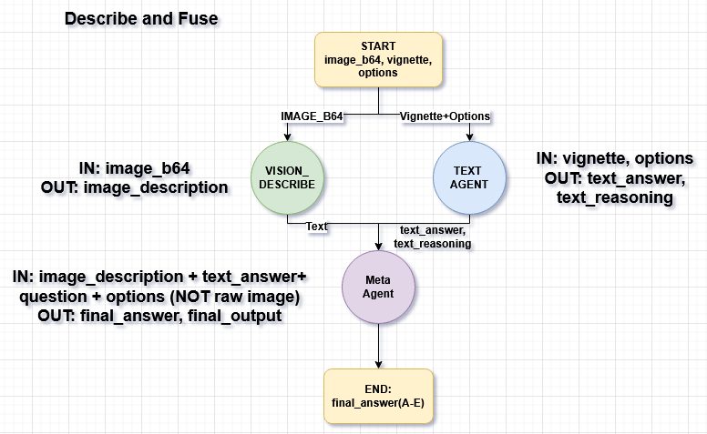
  <br/>
  <em> Describe-then-Fuse: vision describes only (never sees question/options); orchestrator fuses description with text answer; reasons over text, not raw image.</em>
</p>

- **Vision node**: image only --> image_description (no question, no options, no diagnosis)
- **Text node**: vignette + options --> text_answer + reasoning (optional web search)
- **Orchestrator (Qwen)**: image_description + text_answer + question + options --> final_answer
- **Result**: 48.9% -- first architecture to beat both single-agent baselines

#### 2. Directed Debate

<!-- TODO: Replace with your directed debate diagram -->
<p align="center">
  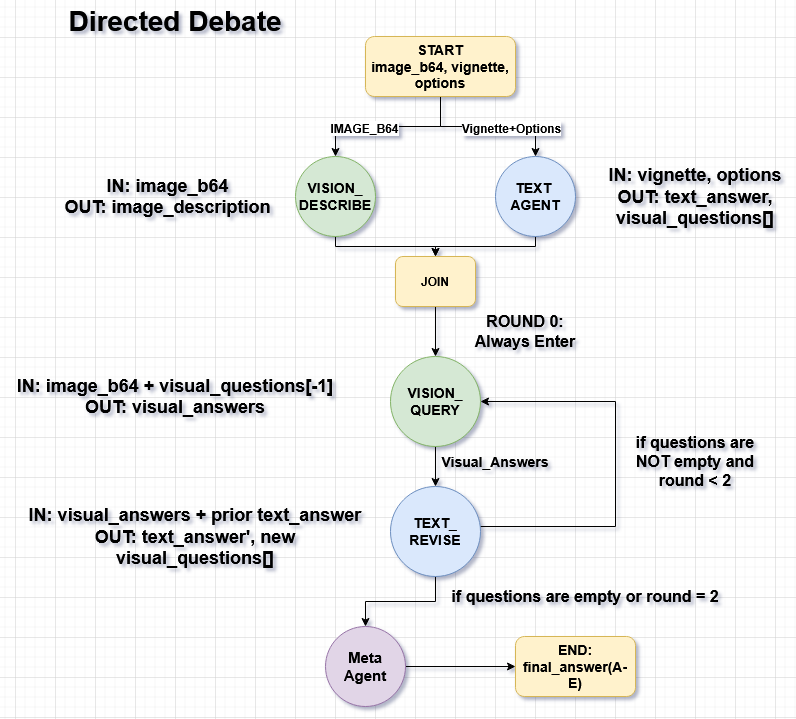
  <br/>
  <em>Directed Debate: text agent drives targeted visual questions; vision answers from image only; asymmetric (only text revises).</em>
</p>

<!-- TODO: Replace with your directed debate loop conditions -->
<p align="center">
  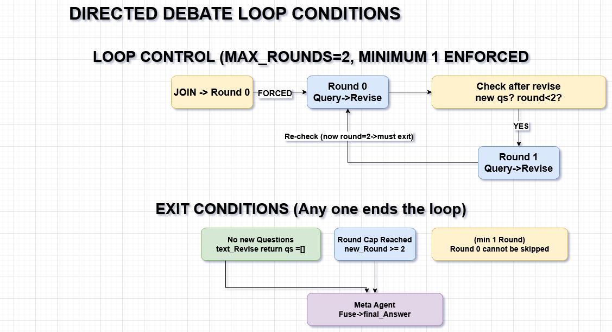
  <br/>
  <em>Loop control: MAX_ROUNDS=2, minimum 1 enforced. Exit on: no new questions, round cap reached, or min-1-round satisfied.</em>
</p>

- **Parallel init**: vision_describe || text_initial --> join barrier
- **Loop**: text asks questions --> vision answers from image (no options) --> text revises
- **Orchestrator**: sees revised answer + baseline description (NOT the Q&A transcript)
- **Result**: 45.6% -- lowest LangGraph architecture. Net -56 on 277 changed answers. Persuasion bias persists even with asymmetric + directed design.

#### 3. Conditional Debate

<!-- TODO: Replace with your conditional debate diagram -->
<p align="center">
  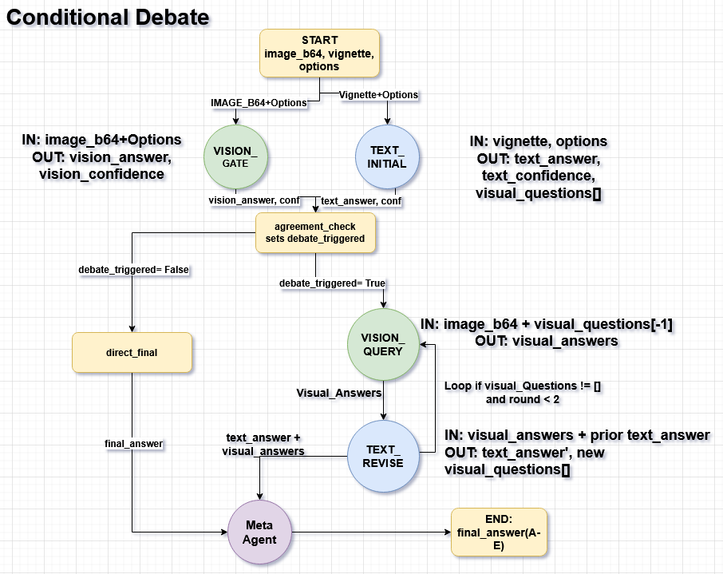
  <br/>
  <em>Conditional Debate: agreement check routes easy cases directly, hard cases through debate loop.</em>
</p>

<!-- TODO: Replace with your conditional debate routing rules -->
<p align="center">
  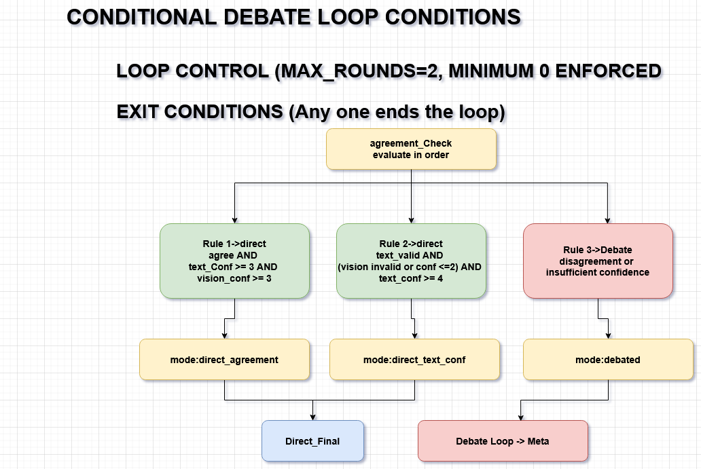
  <br/>
  <em> Routing rules: Rule 1: agree + both conf >= 3 --> direct. Rule 2: text valid + conf >= 4 + weak vision --> direct. Rule 3: otherwise --> debate.</em>
</p>

- **Parallel init**: text_initial (vignette + options) || vision_gate (image + options, no vignette)
- **Routing**: agreement_check decides direct vs debate based on agreement and confidence
- **Direct path**: 296 cases (43%) at **55.74%** -- above text-only baseline
- **Debate path**: 393 cases (57%) at 47.33% -- harder cases, debate helped/hurt = 57/40 (net +17)
- **Result**: **50.94%** -- highest multi-agent accuracy in the study

#### 4. Option Ranking

<!-- TODO: Replace with your option ranking diagram -->
<p align="center">
  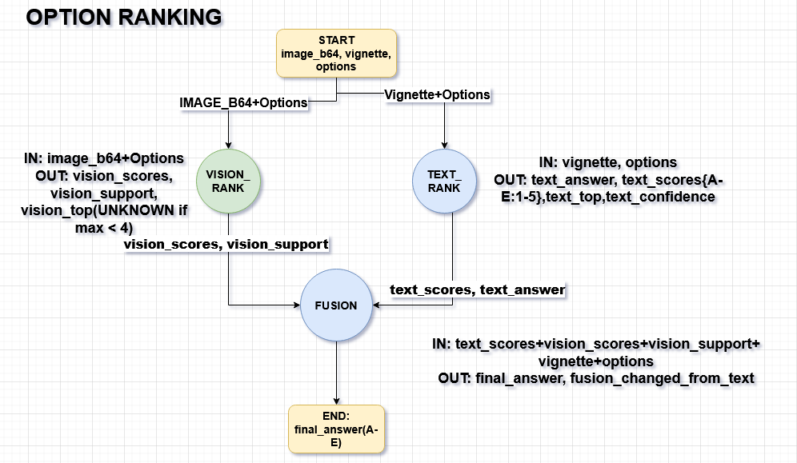
  <br/>
  <em>Option Ranking: each modality scores all 5 options; fusion aggregates both score vectors. Vision abstains (UNKNOWN) when top score < 4.</em>
</p>

- **Text rank**: vignette + options (no image) --> text_scores {A-E: 1-5}, text_top, confidence
- **Vision rank**: image + options (no vignette) --> vision_scores, vision_support labels, vision_top
- **Fusion (MedGemma)**: both score vectors + vignette + options --> final_answer
- **Result**: 50.8%. Text-top alone was 55.7% -- fusion **destroyed** 5 points. 130 changes: 26 helped, 60 hurt (net -34). Clearest single demonstration of fusion harm.

#### 5. Conservative Conditional Debate

<!-- TODO: Replace with your conservative conditional debate diagram -->
<p align="center">
  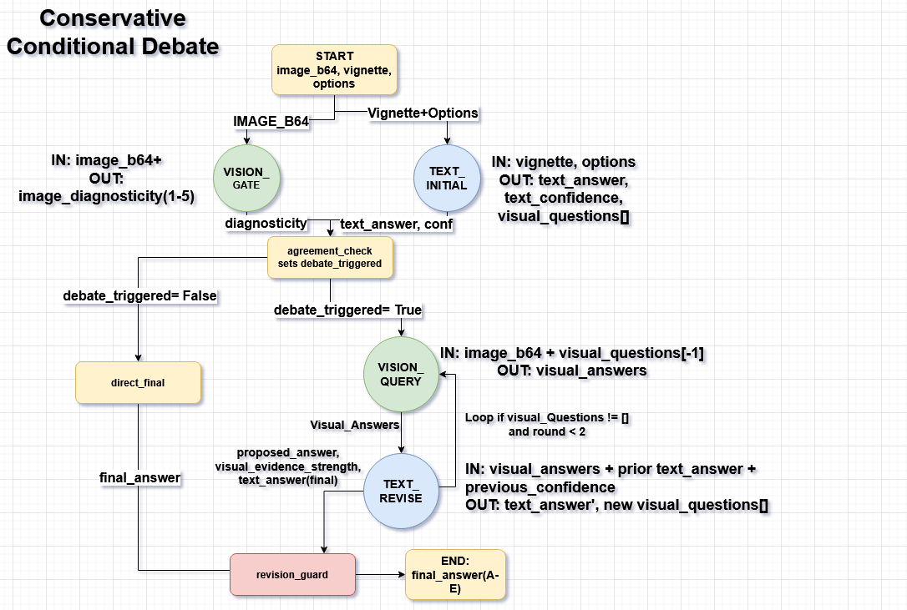
  <br/>
  <em>Conservative Conditional Debate: vision gate sees image only (no options); deterministic revision guard replaces LLM orchestrator.</em>
</p>

<!-- TODO: Replace with your conservative debate guard logic -->
<p align="center">
  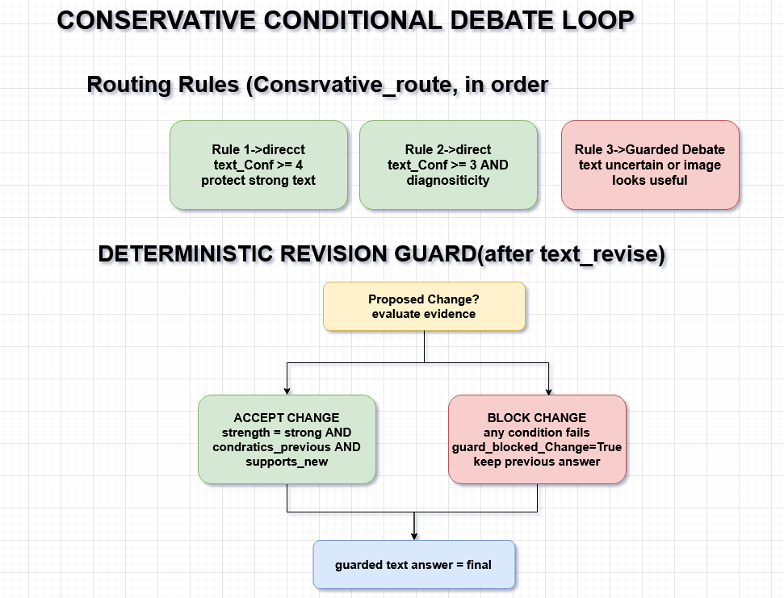
  <br/>
  <em> Guard logic Routing: text conf >= 4 --> direct; text conf >= 3 + low diagnosticity --> direct; else --> guarded debate. Guard accepts change only if: strength=strong AND contradicts_previous AND supports_new.</em>
</p>

- **Vision gate**: image ONLY (no options, no vignette) --> image_diagnosticity (1-5)
- **Conservative route**: protects strong text answer with narrower gate than conditional
- **Revision guard**: deterministic Python function, NOT an LLM. Accepts proposed answer change only on strong + contradictory + supportive visual evidence
- **No orchestrator**: guarded text answer IS the final answer
- **Result**: 49.4%. Direct: 515 cases (75%) at **56.12%**. Debated: 174 cases (25%) at 29.31%. Guard: 32 proposed, 18 blocked, 14 approved (6 helped, 3 hurt, net +3). **Only fusion mechanism in the study with net-positive changes.**

---

## Full Results

### Baselines (689 cases)

| Condition | Accuracy | Notes |
|---|---|---|
| Text-only (MedGemma) | **51.5%** | Strongest individual component |
| Text-only (Qwen, Mode 1) | 52.7% | Confirms text strength |
| Vision-only (MedGemma) | 33.2% | Context-free vision floor |
| Vision-only (Qwen) | 30.3% | Floor is model-independent |
| Single-agent full (MedGemma) | 47.0% | Image *hurts* -- below text-only |
| Single-agent full (Qwen) | 48.5% | Same pattern |
| **Oracle ceiling** | **65.5%** | 451/689: at least one agent correct |

### All Experiments Ranked (689 cases)

| # | Experiment | Accuracy | vs Text-Only | vs Single-Agent | Oracle Gap |
|---|---|---|---|---|---|
| -- | Oracle ceiling | 65.5% | +14.0pp | +18.5pp | 0.0pp |
| -- | Text-only baseline | 51.5% | -- | +4.5pp | 14.0pp |
| 1 | **Conditional debate (LG)** | **50.94%** | -0.6pp | +3.9pp | 14.6pp |
| 2 | Option ranking (LG) | 50.80% | -0.7pp | +3.8pp | 14.7pp |
| 3 | Describe-then-fuse (LG) | 49.49% | -2.0pp | +2.5pp | 16.0pp |
| 4 | Conservative conditional (LG) | 49.35% | -2.2pp | +2.3pp | 16.2pp |
| -- | Single-agent full | 47.02% | -4.5pp | -- | 18.5pp |
| 5 | Mode 3b: Structured debate | 46.7% | -4.8pp | -0.3pp | 18.8pp |
| 6 | Mode 2: CoT debate | 46.0% | -5.5pp | -1.0pp | 19.5pp |
| 7 | Directed debate (LG) | 45.57% | -5.9pp | -1.5pp | 19.9pp |
| 8 | Mode 3: Structured JSON | 44.9% | -6.6pp | -2.1pp | 20.6pp |
| 9 | Mode 1: CoT output-only | 40.9% | -10.6pp | -6.1pp | 24.6pp |
| 10 | RAG text agent | 37.01% | -14.5pp | -10.0pp | 28.5pp |

### Sycophantic Convergence in Debate

| Experiment | Text R1 to R2 | Vision R1 to R2 | Text Net | Vision Net | Oracle Change |
|---|---|---|---|---|---|
| Mode 2: CoT debate | 50.4% to 41.7% | 33.2% to 43.5% | **-60** | +71 | 439 to 381 (-58) |
| Mode 3b: Structured debate | 54.3% to 42.7% | 32.2% to 53.0% | **-80** | +143 | 451 to 430 (-21) |

### LangGraph Routing Analysis

| Architecture | Direct Cases | Direct Acc | Debated Cases | Debated Acc | Changes: Help/Hurt |
|---|---|---|---|---|---|
| Conditional debate | 296 (43%) | **55.74%** | 393 (57%) | 47.33% | 57 / 40 (net +17) |
| Conservative conditional | 515 (75%) | **56.12%** | 174 (25%) | 29.31% | 6 / 3 (net +3) |
| Directed debate | -- | -- | 689 (100%) | 45.57% | 55 / 111 (net -56) |
| Option ranking | -- | -- | -- | 50.80% | 26 / 60 (net -34) |

### ThoughtComm vs Debate (339 test cases)

| Metric | Mode 2 Debate | ThoughtComm |
|---|---|---|
| Text R1 to R2 | 47.5% to 40.4% (-7.1pp) | 34.8% to 44.0% (**+9.2pp**) |
| Text net cases changed | -24 | **+31** |
| Communication channel | Natural language | Latent hidden states |

---

## Research Contributions

1. **First systematic comparison** of inter-agent communication mechanisms on a multimodal medical task under controlled conditions
2. **First multimodal medical evaluation** of ThoughtComm (latent thought communication)
3. **Oracle ceiling methodology** for quantifying the arbitration bottleneck in multi-agent systems
4. **Discovery of sycophantic convergence** in medical multi-agent debate, quantified via oracle decay
5. **Five novel dilution-countering architectures** with empirical evaluation
6. **Dual role of confidence** finding: reliable for triage routing, unreliable for per-disagreement arbitration
7. **Deterministic guarding** shown to outperform LLM arbitration at small model scale
8. **RAG and web search degradation** on context-rich diagnostic cases -- challenging the assumption that more information always helps

---

## Project Structure

```
HonoursProject/
+-- data/
|   +-- loader.py                    # NEJM dataset loader, image handling, prompt formatting
+-- dataset/
|   +-- image_challenge_dataset.json # NEJM case metadata (689 cases)
+-- diff_agents/                     # Phase 1: OpenAI Agents SDK agent definitions
|   +-- textAgent.py                 # Text specialist (vignette + options)
|   +-- visionAgent.py               # Vision specialist (image + options)
|   +-- metaAgent.py                 # Fusion/meta agent
|   +-- singleAgent.py              # Single-agent baseline
+-- evaluation/
|   +-- evaluator.py                 # W&B logging, per-case metrics, agreement analysis
|   +-- json_parser.py              # Tolerant JSON parser for structured communication
+-- langgraph_exp/                   # Phase 2: LangGraph orchestration experiments
|   +-- state.py / nodes.py / graph.py           # Describe-then-fuse
|   +-- debate_state.py / debate_nodes.py / debate_graph.py  # Directed debate
|   +-- conditional_state.py / conditional_nodes.py / conditional_graph.py  # Conditional debate
|   +-- option_rank_state.py / option_rank_nodes.py / option_rank_graph.py  # Option ranking
|   +-- conservative_state.py / conservative_nodes.py / conservative_graph.py  # Conservative
|   +-- run_orchestrator.py          # Describe-then-fuse runner
|   +-- run_debate.py                # Directed debate runner
|   +-- run_conditional_debate.py    # Conditional debate runner
|   +-- run_option_ranking.py        # Option ranking runner
|   +-- run_conservative_conditional_debate.py  # Conservative runner
|   +-- lg_loader.py                 # Adapter over data/loader.py
|   +-- tools.py                     # Web search tool (toggleable + audited)
|   +-- check_images.py              # Image-loading diagnostic
+-- thoughtcomm/                     # ThoughtComm implementation
|   +-- phase0_extract_hidden_states.py
|   +-- phase1_train_autoencoder.py
|   +-- phase2_train_adapter.py
|   +-- phase3_evaluate.py
+-- data_analysis/
|   +-- analysis.py                  # Post-hoc: difficulty, oracle, transitions, McNemar
+-- main.py                          # Phase 1: Mode 1 (CoT output-only)
+-- main_debate.py                   # Phase 1: Mode 2 (CoT debate)
+-- main_structured.py               # Phase 1: Mode 3/3b (Structured JSON +/- debate)
+-- wandb_exports/                   # W&B table exports for analysis
+-- docs/                            # Architecture diagrams and figures
```

---

## Setup & Installation

### Prerequisites

- Python 3.11+
- [Ollama](https://ollama.ai) with models pulled:
  ```bash
  ollama pull medgemma1.5:4b
  ollama pull qwen2.5vl:7b
  ```
- ~45GB VRAM (both models resident simultaneously)

### Environment

```bash
# Clone
git clone https://github.com/SamruddhaDinde/HonoursProject.git
cd HonoursProject

# Install dependencies
pip install -r requirements.txt

# Configure
cp .env.example .env
# Edit .env with your keys:
#   WANDB_API_KEY=...
#   LANGSMITH_API_KEY=ls__...
#   LANGSMITH_TRACING=true
#   LANGSMITH_PROJECT=nejm-orchestrator
#   TAVILY_API_KEY=tvly_...  (optional, for web search experiments)
```

### Running Experiments

```bash
# Phase 1: Communication-mechanism experiments
python main.py --n 689                    # Mode 1: CoT output-only
python main_debate.py --n 689             # Mode 2: CoT debate
python main_structured.py --n 689         # Mode 3/3b: Structured JSON

# Phase 2: LangGraph orchestration experiments
python -m langgraph_exp.run_orchestrator --search off --n 689     # Describe-then-fuse
python -m langgraph_exp.run_debate --n 689                        # Directed debate
python -m langgraph_exp.run_conditional_debate --n 689            # Conditional debate
python -m langgraph_exp.run_option_ranking --n 689                # Option ranking
python -m langgraph_exp.run_conservative_conditional_debate --n 689  # Conservative

```


---

## Tech Stack

| Component | Technology |
|---|---|
| Models | MedGemma-1.5-4B, Qwen2.5-VL-7B |
| Model serving | Ollama (OpenAI-compatible API) |
| Phase 1 orchestration | OpenAI Agents SDK |
| Phase 2 orchestration | LangGraph (stateful graphs, conditional routing, parallel execution) |
| Experiment tracking | Weights & Biases (per-case tables, running metrics) |
| Trace inspection | LangSmith (per-node input/output traces) |
| Compute | UTS iHPC, Singularity containers, ~45GB VRAM |
| Analysis | pandas, scipy (McNemar's test), matplotlib |
| ThoughtComm | HuggingFace Transformers, PyTorch (autoencoder + prefix adapter) |

---

## Dataset

[NEJM Image Challenge](https://www.nejm.org/image-challenge) -- 689 diagnostic cases, each with:
- Clinical vignette (patient context)
- Diagnostic image (clinical photo, radiograph, MRI, etc.)
- 5 answer options (one correct)
- Public vote distribution + Brier score

Case metadata sourced from [cx0/nejm-image-challenge](https://github.com/cx0/nejm-image-challenge).

---
